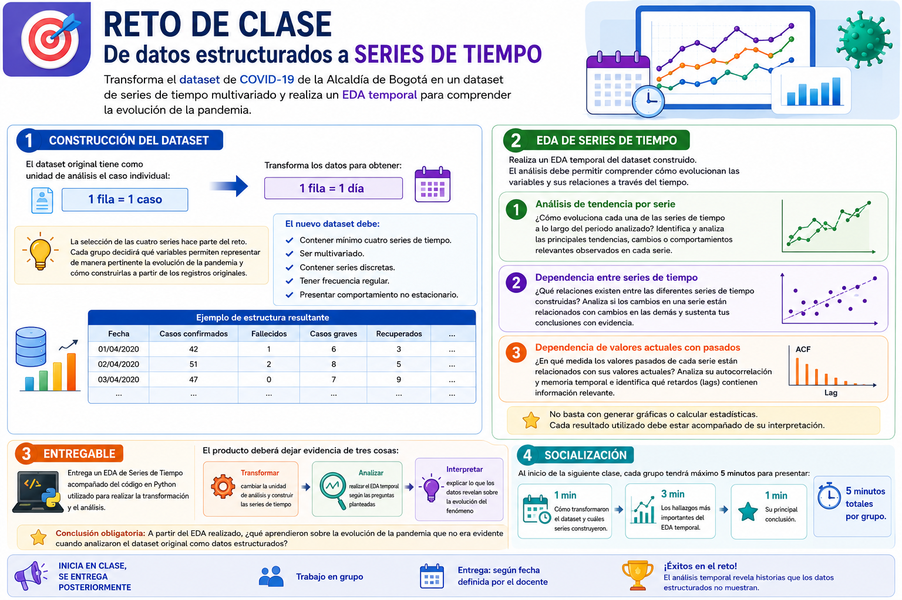
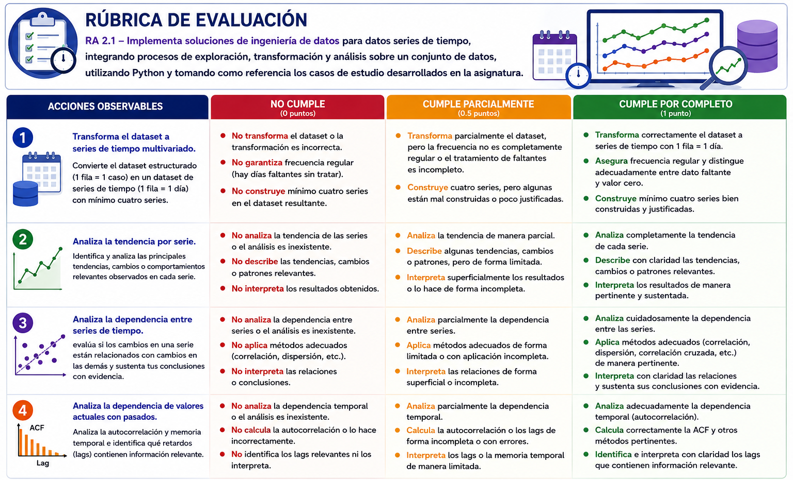

# 🧩 Reto de Clase: De Datos Estructurados a Series de Tiempo

A partir del dataset de COVID-19 de la Alcaldía de Bogotá, transforma los datos estructurados en un dataset de **series de tiempo multivariado** y realiza un **EDA temporal**.

---

## 📊 Rúbrica de Evaluación

La siguiente rúbrica presenta las acciones observables y los niveles de desempeño utilizados para evaluar el reto.

